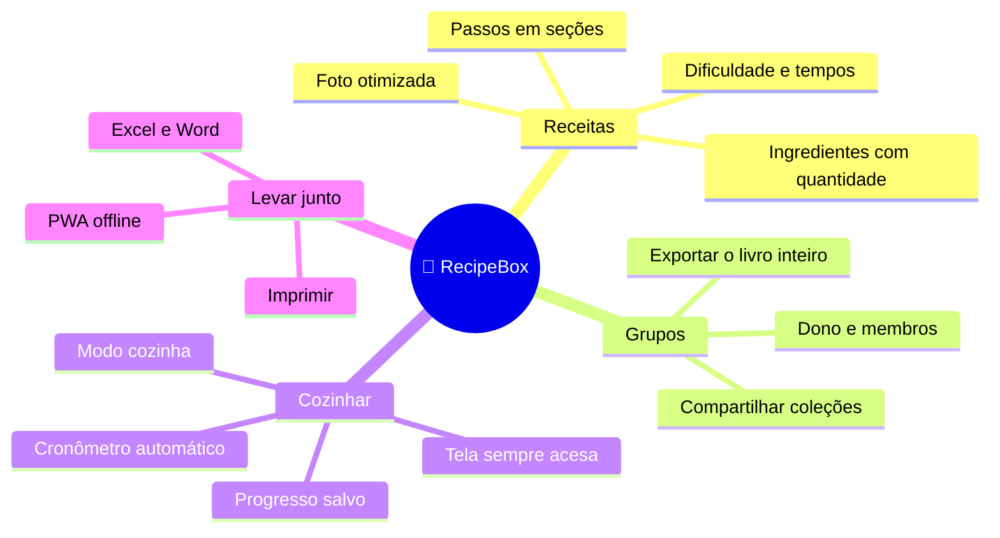
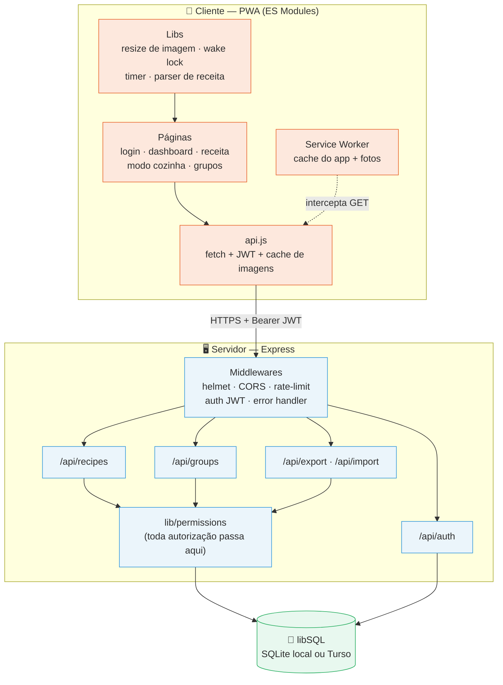
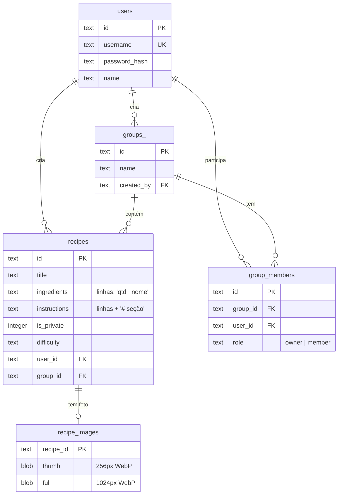
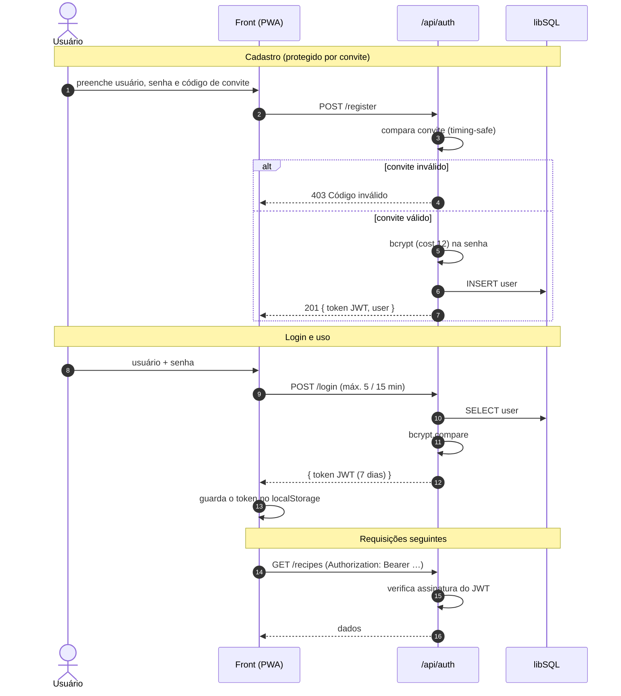
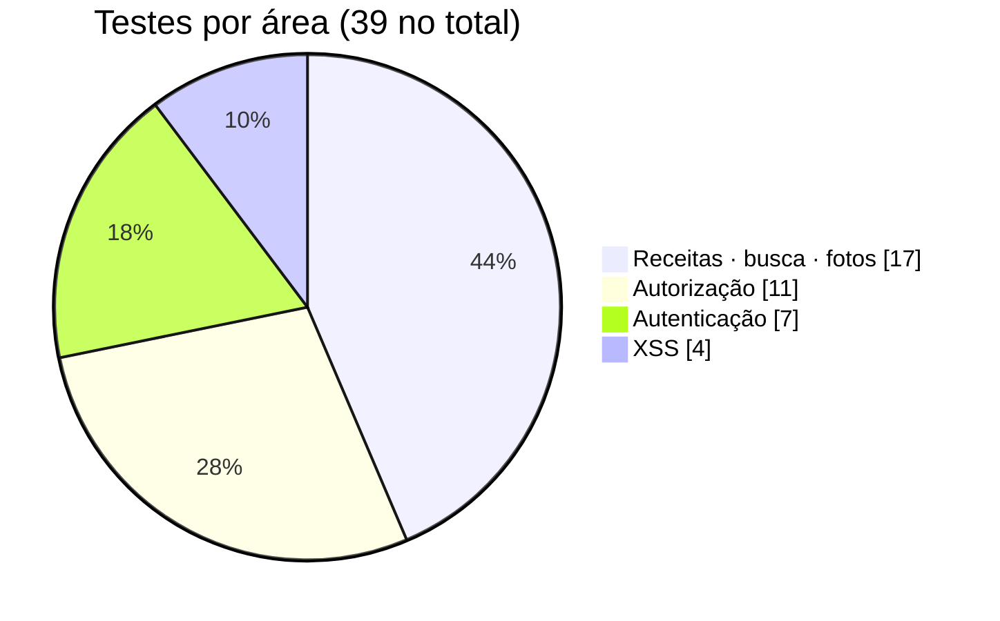

<div align="center">

# 🍳 RecipeBox

### Seu livro de receitas online — colaborativo, offline e feito para a cozinha

Guarde as receitas da família num só lugar, compartilhe em grupos, e siga o modo de preparo
com a tela sempre acesa e cronômetros automáticos enquanto cozinha.

<br>


</div>

---

## 📑 Índice

- [O que é](#-o-que-é)
- [Destaques](#-destaques)
- [Demonstração das telas](#-demonstração-das-telas)
- [Arquitetura](#-arquitetura)
- [Modelo de dados](#-modelo-de-dados)
- [Fluxo de autenticação](#-fluxo-de-autenticação)
- [Como rodar](#-como-rodar)
- [Variáveis de ambiente](#-variáveis-de-ambiente)
- [Referência da API](#-referência-da-api)
- [Segurança](#-segurança)
- [Testes](#-testes)
- [Estrutura do projeto](#-estrutura-do-projeto)
- [Deploy](#-deploy)
- [Licença](#-licença)

---

## 🎯 O que é

RecipeBox é um **PWA** (aplicativo web instalável) para guardar e compartilhar receitas.
Nasceu para uso de família e amigos: cada pessoa tem sua conta, cria receitas pessoais ou
privadas, e monta **grupos** para compartilhar coleções — o clássico "receitas da vovó" que
todo mundo quer ter à mão.

O foco não é só **guardar** a receita, é **cozinhar** a partir dela. Por isso o modo cozinha,
o checklist com progresso salvo e os cronômetros. E como PWA, funciona offline: as receitas já
abertas continuam disponíveis mesmo sem sinal.



---

## ✨ Destaques

| | Recurso | Descrição |
|---|---|---|
| 👩‍🍳 | **Modo Cozinha** | Tela cheia, passos grandes, [Wake Lock](https://developer.mozilla.org/docs/Web/API/Screen_Wake_Lock_API) para a tela não apagar e **cronômetro automático** quando o passo menciona um tempo ("asse por 40 minutos") |
| ✅ | **Checklist com progresso** | Marque ingredientes e passos; o progresso fica salvo no dispositivo mesmo que você feche o app |
| 👥 | **Grupos** | Crie grupos, adicione membros por usuário e compartilhe receitas — com papéis de dono e membro |
| 📷 | **Fotos otimizadas** | A imagem é redimensionada **no navegador** antes de subir (WebP, ~80 KB) — sem depender de `sharp` no servidor |
| 🔎 | **Busca real** | Busca no servidor por título, categoria **e ingredientes**, com filtro por categoria e ordenação |
| 🔐 | **Cadastro por convite** | Cadastro público protegido por código de convite — grupo fechado sem precisar criar conta manualmente |
| 📤 | **Exportar / Importar** | Exporte para **Excel** e **Word** (receita ou grupo inteiro); importe uma planilha de receitas de uma vez |
| 🌙 | **Tema claro/escuro** | Segue a preferência do sistema, com alternância manual |
| 📱 | **PWA offline** | Instalável no celular, com service worker que serve o app e as fotos sem conexão |
| ♿ | **Acessível** | Navegação por teclado, foco visível, rótulos ARIA e suporte a *reduced motion* |

---

## 📸 Demonstração das telas

> As telas são renderizadas 100% no cliente a partir da mesma paleta (laranja `#E8652D`).
> Rode `npm run seed && npm run dev` e acesse `http://localhost:3000` para explorar com dados de exemplo.

```
┌─────────────────────────────┐   ┌─────────────────────────────┐   ┌─────────────────────────────┐
│  🍳 RecipeBox        🌙 ⏻   │   │  ← Bolo de Cenoura          │   │  ✕  Bolo de Cenoura         │
│ ┌─────────────────────────┐ │   │  ┌───────────────────────┐  │   │  💡 Tela sempre acesa       │
│ │ 🔍 farinha            ✕ │ │   │  │      [ foto ]         │  │   │  ▓▓▓▓▓▓░░░░  3/6            │
│ └─────────────────────────┘ │   │  └───────────────────────┘  │   │                             │
│  [Todas][Privadas][Grupos]  │   │  ⏱20min 🍽12 ⭐⭐☆         │   │  # Massa                    │
│  Bolos ▾   Recentes ▾       │   │                             │   │  ┌───────────────────────┐  │
│ ┌─────────────────────────┐ │   │  👩‍🍳 MODO COZINHA          │   │  │ ☑ 1  Bata a cenoura…  │  │
│ │ [foto]  🏷Bolos ⭐⭐☆  │ │   │                             │   │  │ ☑ 2  Acrescente…      │  │
│ │ Bolo de Cenoura         │ │   │  📝 Ingredientes            │   │  │ ☐ 3  Misture   ⏱2:00 │  │
│ │ Fofinho com cobertura   │ │   │  ☐ 3 un  cenoura ralada    │   │  └───────────────────────┘  │
│ │ ⏱1h 🍽12                │ │   │  ☐ 4 un  ovos              │   │  # Cobertura                │
│ └─────────────────────────┘ │   │  👩‍🍳 Modo de Preparo        │   │  ┌───────────────────────┐  │
│                        (+)  │   │  ▓▓▓▓░░░░  2/6 passos       │   │  │   ⏱ 1:47   [Cancelar] │  │
│  📖 Receitas   👥 Grupos    │   │  ✏️ Editar  🗑️  🖨️  📄     │   │  └───────────────────────┘  │
└─────────────────────────────┘   └─────────────────────────────┘   └─────────────────────────────┘
        Dashboard                       Detalhe da receita                    Modo Cozinha
```

---

## 🏗 Arquitetura

Monólito enxuto: um servidor Express serve tanto a API JSON quanto o front estático (PWA em
ES Modules, **sem build step**). O banco é libSQL — o mesmo código roda em SQLite local no
desenvolvimento e em Turso na nuvem.



**Princípio central:** toda decisão de autorização ("posso ver/editar isto?") vive em
`lib/permissions.js`. Antes, essa checagem estava copiada em cada rota — e foi exatamente uma
cópia esquecida que abriu uma falha de segurança (veja [Segurança](#-segurança)).

---

## 🗃 Modelo de dados



As fotos ficam numa **tabela separada** de propósito: se morassem na linha da receita, toda
listagem arrastaria os binários junto. A listagem devolve apenas um sinalizador `has_image`.

---

## 🔐 Fluxo de autenticação



---

## 🚀 Como rodar

**Pré-requisitos:** Node.js ≥ 18.

```bash
# 1. Instale as dependências
npm install

# 2. Crie o .env a partir do exemplo
cp .env.example .env

# 3. Gere um segredo forte para o JWT e cole no .env (JWT_SECRET)
npm run secret

# 4. Defina um INVITE_CODE no .env (qualquer texto secreto)
#    — é ele que libera o cadastro de novas contas

# 5. (Opcional) Popule com dados de exemplo
npm run seed        # cria admin / 123456 e o grupo "Família Silva"

# 6. Suba o servidor
npm run dev         # com --watch (recarrega ao salvar)
# ou
npm start
```

Acesse **http://localhost:3000**.

> **Primeiro usuário sem convite?** Use `npm run create-user` — um assistente interativo que
> pergunta usuário e senha (nada fica salvo em código).

---

## ⚙ Variáveis de ambiente

| Variável | Obrigatória | Padrão | Descrição |
|---|:---:|---|---|
| `JWT_SECRET` | ✅ | — | Segredo de assinatura do JWT. **Mínimo 32 caracteres** — o servidor não sobe sem isso. Gere com `npm run secret` |
| `INVITE_CODE` | — | *(vazio)* | Código exigido no cadastro. Vazio = cadastro público **desativado** |
| `DATABASE_URL` | — | `file:./data.db` | SQLite local (`file:…`) ou Turso (`libsql://…`) |
| `TURSO_AUTH_TOKEN` | — | — | Token do Turso (só ao usar Turso) |
| `PORT` | — | `3000` | Porta do servidor |
| `NODE_ENV` | — | `development` | `production` desativa logs verbosos e o seed |
| `CORS_ORIGIN` | — | *(vazio)* | Origens permitidas se o front for hospedado à parte. Vazio = só mesma origem |

---

## 📡 Referência da API

Todas as rotas (exceto `/login`, `/register` e `/config`) exigem o header
`Authorization: Bearer <token>`. **22 endpoints** no total.

### Autenticação — `/api/auth`

| Método | Rota | Descrição |
|---|---|---|
| `POST` | `/login` | Login. Body: `{ username, password }` → `{ token, user }`. Limite: 5 / 15 min |
| `POST` | `/register` | Cadastro. Body: `{ username, password, name, invite_code }`. Limite: 3 / h |
| `GET` | `/me` | Dados do usuário autenticado |
| `GET` | `/config` | `{ registration_enabled }` — o front esconde o cadastro se estiver desligado |

### Receitas — `/api/recipes`

| Método | Rota | Descrição |
|---|---|---|
| `GET` | `/` | Lista. Query: `type` (`private`/`group`), `group_id`, `q`, `category`, `sort` (`recent`/`title`/`time`) |
| `GET` | `/categories` | Categorias distintas visíveis ao usuário |
| `GET` | `/:id` | Detalhe de uma receita |
| `POST` | `/` | Cria uma receita |
| `PUT` | `/:id` | Edita (apenas o dono) |
| `DELETE` | `/:id` | Exclui (apenas o dono) |
| `GET` | `/:id/image?size=thumb\|full` | Foto da receita (com `ETag`) |
| `PUT` | `/:id/image` | Salva a foto. Body: `{ thumb, full }` (data URLs WebP) |
| `DELETE` | `/:id/image` | Remove a foto |

### Grupos — `/api/groups`

| Método | Rota | Descrição |
|---|---|---|
| `GET` | `/` | Meus grupos, com contagem de membros e receitas |
| `POST` | `/` | Cria um grupo (você vira dono) |
| `GET` | `/:id` | Detalhe + membros |
| `POST` | `/:id/members` | Adiciona membro por `username` (só o dono) |
| `DELETE` | `/:id/members/:userId` | Remove membro (só o dono; o dono não pode se remover) |

### Exportar / Importar

| Método | Rota | Descrição |
|---|---|---|
| `GET` | `/api/export/excel` | Exporta receitas para `.xlsx` (query opcional `group_id`) |
| `GET` | `/api/export/word/:id` | Exporta uma receita para `.docx` |
| `GET` | `/api/export/word/group/:groupId` | Exporta o livro do grupo para `.docx` |
| `POST` | `/api/import/excel` | Importa receitas de uma planilha (`multipart`, campo `file`) |

<details>
<summary><b>Exemplo — criar uma receita via <code>curl</code></b></summary>

```bash
TOKEN="seu-jwt-aqui"

curl -X POST http://localhost:3000/api/recipes \
  -H "Authorization: Bearer $TOKEN" \
  -H "Content-Type: application/json" \
  -d '{
    "title": "Bolo de Cenoura",
    "category": "Bolos",
    "difficulty": "Fácil",
    "prep_time": 20,
    "cook_time": 40,
    "servings": 12,
    "ingredients": "3 un | cenoura ralada\n4 un | ovos\n2 xícaras | farinha",
    "instructions": "# Massa\nBata a cenoura, os ovos e o óleo.\nAsse por 40 minutos."
  }'
```

O formato dos campos:
- **Ingredientes:** uma linha por item, `quantidade | nome` (a barra é opcional).
- **Modo de preparo:** uma linha por passo; linhas começando com `# ` viram títulos de seção.

</details>

---

## 🛡 Segurança

Este projeto passou por um endurecimento focado em uso real. As correções mais relevantes:

| Área | O que era | O que ficou |
|---|---|---|
| **XSS armazenado** | HTML montado com `onclick="fn('${título}')"` e um escape que não tratava aspas — um título com `'` executava código no navegador de outros membros | Zero `onclick` inline (delegação por `data-action`) + CSP com `script-src 'self'` + escape completo. Uma regressão é bloqueada em três camadas |
| **Autorização** | `PUT /recipes/:id` não checava o grupo de destino (o `POST` checava) — dava para plantar receita em grupo alheio | Toda autorização centralizada em `lib/permissions.js`; teste de regressão cobre o caso |
| **Credenciais** | Usuário e senha fixos em `scripts/create-user.js` | CLI interativo, nada em código; senha fora do repositório |
| **Força bruta** | Login sem limite | `express-rate-limit`: 5 logins / 15 min, 3 cadastros / h |
| **Cabeçalhos** | Nenhum | `helmet` com CSP, `X-Frame-Options`, `nosniff`, sem `X-Powered-By` |
| **Upload** | `multer` sem limite — um arquivo grande derrubava o processo | Limite de 5 MB, filtro de extensão, validação de *magic bytes* na imagem |
| **Segredos** | `JWT_SECRET` só falhava no primeiro login | Validado no boot — o servidor não sobe com segredo fraco |
| **Dependências** | `xlsx` com prototype pollution + ReDoS (alta severidade) | Atualizado para a versão corrigida da SheetJS · `npm audit` limpo |

> 🔍 O comparador do código de convite usa `timingSafeEqual` — uma comparação com `===` vazaria
> o código caractere a caractere pelo tempo de resposta.

---

## 🧪 Testes

**39 testes** com o runner nativo do Node (`node:test`) + `supertest` — sem framework externo.

```bash
npm test
```



O foco é o que é perigoso: fronteiras de permissão, o bug de autorização já corrigido (com
teste de regressão), vazamento de receita privada, e a neutralização do XSS. Dois testes
**falham de propósito no código antigo** — são a prova de que a correção é real.

A CI (GitHub Actions) roda a suíte no Node 18, 20 e 22, mais `npm audit`.

---

## 📂 Estrutura do projeto

```
recipebox/
├── server.js              # ponto de entrada (só initDB + listen)
├── app.js                 # monta o Express (testável, sem abrir porta)
├── config.js              # lê e valida o ambiente no boot
├── db.js                  # schema + índices (libSQL)
├── lib/
│   ├── permissions.js     # ⭐ toda a autorização mora aqui
│   ├── validate.js        # validação e sanitização de entrada
│   ├── http-error.js      # erros com status HTTP
│   └── image.js           # validação de imagem no servidor
├── middleware/
│   ├── auth.js            # verificação do JWT
│   └── error.js           # asyncHandler + tratador central de erros
├── routes/                # auth · recipes · groups · export · import
├── scripts/               # create-user · seed · generate-template · migrate
├── test/                  # 39 testes (node:test + supertest)
└── public/                # o PWA — sem build step
    ├── index.html
    ├── manifest.json · sw.js · icon.svg
    ├── css/style.css
    └── js/
        ├── main.js        # boot, rotas, ações
        ├── api.js · state.js · router.js · ui.js
        ├── lib/           # image · timer · wake-lock · recipe-format
        └── pages/         # login · dashboard · recipe-detail
                           # recipe-form · cooking-mode · groups
```

---

## ☁ Deploy

O app é serverless-friendly (as fotos vão para o banco, não para o disco).

**Turso + qualquer plataforma Node:**

1. Crie um banco no [Turso](https://turso.tech) e pegue a URL e o token.
2. Configure as variáveis de ambiente na plataforma (Vercel, Fly, Render…):
   `DATABASE_URL`, `TURSO_AUTH_TOKEN`, `JWT_SECRET`, `INVITE_CODE`.
3. Comando de start: `npm start`.

> Em plataformas atrás de proxy, o app já chama `trust proxy` para o rate-limit enxergar o IP
> real do usuário. Rode o primeiro `npm run create-user` apontando para o banco de produção
> (ou use o `INVITE_CODE` para se cadastrar pela tela).

---

## 📄 Licença

[MIT](LICENSE) © 2026 LuisMarchio03

<div align="center">
<br>
Feito com 🧡 para quem gosta de cozinhar em família.
</div>
